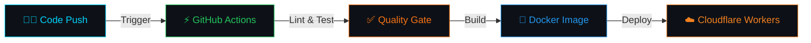

<div align="center">

<!-- HEADER BANNER -->


<!-- TYPING SVG -->
<a href="https://git.io/typing-svg">
  
</a>

</div>


## 🚀 About This Project

> My **personal DevOps portfolio website** built with modern frontend technologies and showcasing my cloud infrastructure, CI/CD pipeline, and security operations expertise.

<table>
<tr>
<td width="60%">

### 🛠️ Tech Stack
| Layer | Technology |
|:------|:-----------|
| **Framework** | React 18 + TypeScript |
| **3D Graphics** | Three.js + WebGL |
| **Animations** | GSAP (GreenSock) |
| **Build Tool** | Vite |
| **Styling** | CSS3 + Custom Properties |
| **Deployment** | Cloudflare Workers |
| **Linting** | ESLint |

</td>
<td width="40%">

### ⚡ Features
- 🎨 **3D Interactive UI** with Three.js
- 🌊 **Smooth Animations** via GSAP
- ♾️ **DevOps Project Showcase**
- 🐳 **Containerized Deployments**
- ☁️ **Cloud Architecture Diagrams**
- 🔒 **Security Tools Expertise**
- 📱 **Fully Responsive Design**
- ⚡ **Lightning Fast** with Vite

</td>
</tr>
</table>


## ♾️ DevOps Skills Showcased

<div align="center">

### ☁️ Cloud & Infrastructure
<p>
  
  
  
  
</p>

### ⚡ CI/CD & Automation
<p>
  
  
  
  
</p>

### 📊 Monitoring & Security
<p>
  
  
  
  
</p>

### 💻 Frontend Stack
<p>
  
  
  
  
  
</p>

</div>


## 📁 Project Structure

```
portfolio/
├── 📂 public/              # Static assets & images
│   └── 📂 images/          # Portfolio preview images
├── 📂 src/                  # Application source code
│   ├── 📂 components/      # React components
│   ├── 📂 styles/          # CSS stylesheets
│   └── 📄 main.tsx         # Entry point
├── 📄 index.html            # HTML entry
├── 📄 vite.config.ts        # Vite configuration
├── 📄 tsconfig.json         # TypeScript config
├── 📄 wrangler.toml         # Cloudflare Workers config
├── 📄 eslint.config.js      # Linting rules
└── 📄 package.json          # Dependencies & scripts
```


## 🚀 Quick Start

### Prerequisites
- **Node.js** >= 18.x
- **npm** >= 9.x

### Installation

```bash
# Clone the repository
git clone https://github.com/saichandram-sadhu/portfolio.git

# Navigate to project directory
cd portfolio

# Install dependencies
npm install

# Start development server
npm run dev
```

### Build for Production

```bash
# Create production build
npm run build

# Preview production build
npm run preview
```

> ⚠️ **Note**: GSAP Club plugins have been replaced with trial plugins. Trial plugins cannot be hosted. For Club plugins, check: [gsap.com/docs/v3/Installation](https://gsap.com/docs/v3/Installation/)


## 🐳 Docker Setup (DevOps Ready)

```dockerfile
# Multi-stage build for optimized production image
FROM node:18-alpine AS builder
WORKDIR /app
COPY package*.json ./
RUN npm ci
COPY . .
RUN npm run build

FROM nginx:alpine AS production
COPY --from=builder /app/dist /usr/share/nginx/html
EXPOSE 80
CMD ["nginx", "-g", "daemon off;"]
```

```bash
# Build Docker image
docker build -t portfolio:latest .

# Run container
docker run -d -p 3000:80 portfolio:latest
```


## ♾️ CI/CD Pipeline




## 🔗 Connect With Me

<div align="center">
  <a href="https://github.com/saichandram-sadhu">
    
  </a>
  <a href="https://www.linkedin.com/in/saichandram-sadhu-9980a2357/">
    
  </a>
  <a href="mailto:saichandram.sadhu.it@gmail.com">
    
  </a>
</div>

<br>

## 📄 License

This project is open source and available under the [MIT License](LICENSE).

<div align="center">


</div>
